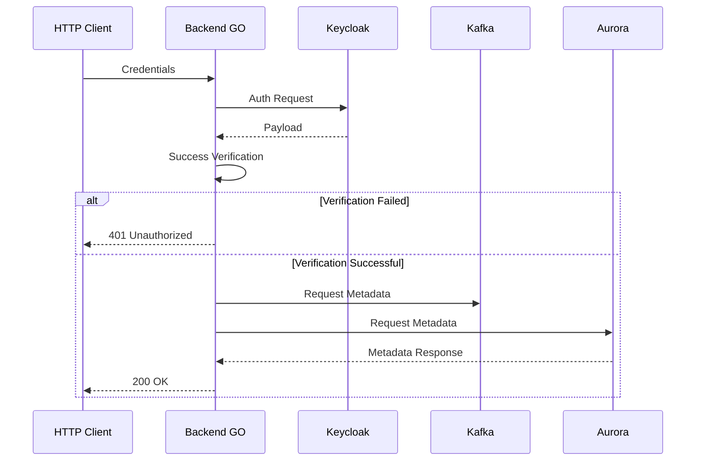
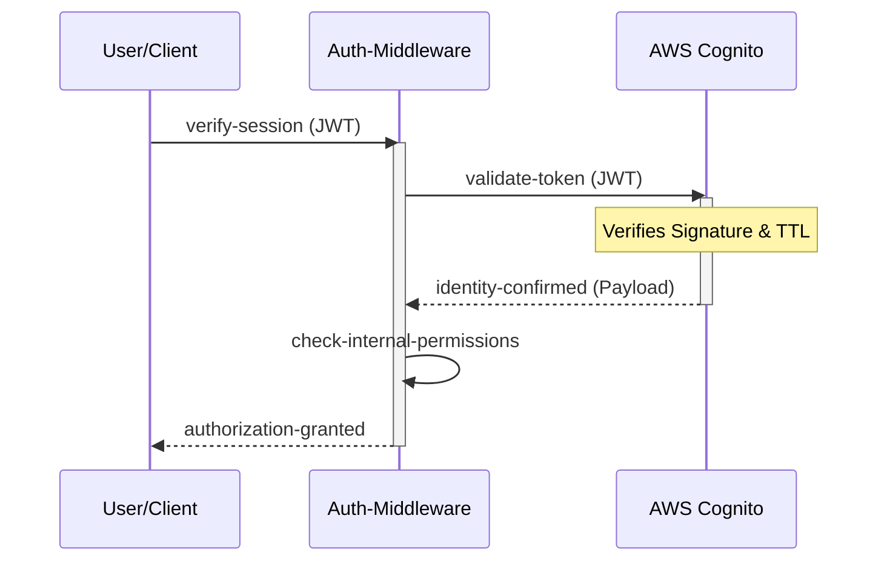
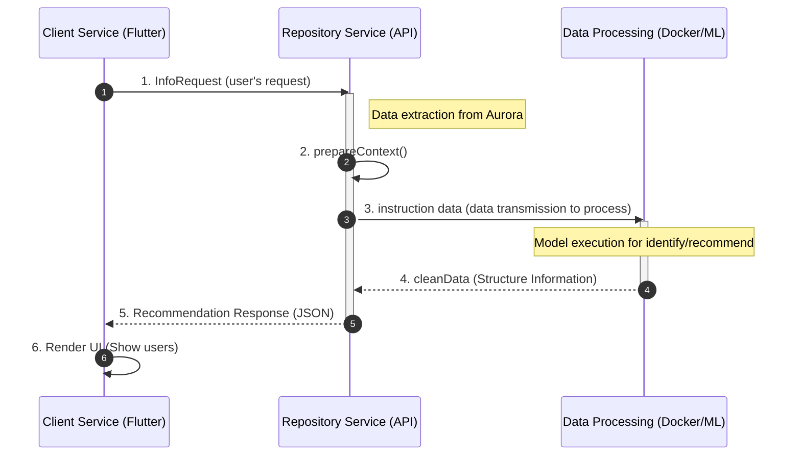
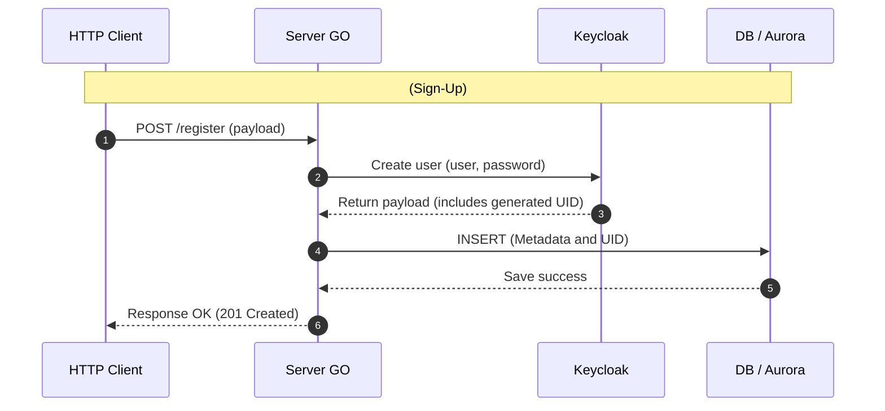
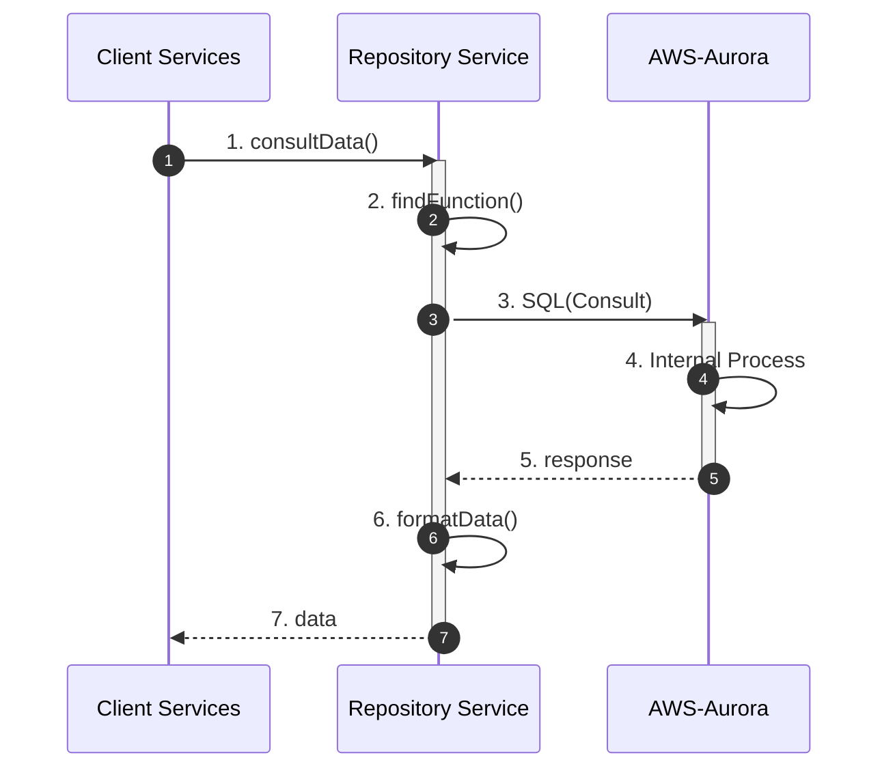

### Login Module

```mermaid
sequenceDiagram
    participant Client as HTTP Client
    participant Go as Backend GO
    participant KC as Keycloak
    participant Kafka as Kafka
    participant DB as Aurora

    Client->>Go: Credentials
    Go->>KC: Auth Request
    KC-->>Go: Payload
    
    Go->>Go: Success Verification
    
    alt Verification Failed
        Go-->>Client: 401 Unauthorized
    else Verification Successful
        Go->>Kafka: Request Metadata
        Go->>DB: Request Metadata
        DB-->>Go: Metadata Response
        Go-->>Client: 200 OK
    end
```

### Auth Module

```mermaid
sequenceDiagram
    participant U as User/Client
    participant A as Auth-Middleware
    participant AWS as AWS Cognito

    U->>A: verify-session (JWT)
    activate A
    A->>AWS: validate-token (JWT)
    activate AWS
    Note over AWS: Verifies Signature & TTL
    AWS-->>A: identity-confirmed (Payload)
    deactivate AWS
    A->>A: check-internal-permissions
    A-->>U: authorization-granted
    deactivate A
```
### Recomendation Module

```mermaid
sequenceDiagram
    autonumber
    participant C as Client Service (Flutter)
    participant R as Repository Service (API)
    participant DP as Data Processing (Docker/ML)

    C->>R: 1. InfoRequest (user's request)
    activate R
    Note right of R: Data extraction from Aurora
    R->>R: 2. prepareContext()
    R->>DP: 3. instruction data (data transmission to process)
    activate DP
    Note over DP: Model execution for identify/recommend
    DP-->>R: 4. cleanData (Structure Information)
    deactivate DP
    R-->>C: 5. Recommendation Response (JSON)
    deactivate R
    C->>C: 6. Render UI (Show users)
```

### Register Module

```mermaid
sequenceDiagram
    autonumber
    participant Client as HTTP Client
    participant Go as Server GO
    participant KC as Keycloak
    participant DB as DB / Aurora

    Note over Client, DB: (Sign-Up)
    
    Client->>Go: POST /register (payload)
    Go->>KC: Create user (user, password)
    KC-->>Go: Return payload (includes generated UID)
    Go->>DB: INSERT (Metadata and UID)
    DB-->>Go: Save success
    Go-->>Client: Response OK (201 Created)
```

### Repository Module

```mermaid
sequenceDiagram
    autonumber
    participant C as Client Services
    participant R as Repository Service
    participant A as AWS-Aurora

    C->>R: 1. consultData()
    activate R
    R->>R: 2. findFunction()
    R->>A: 3. SQL(Consult)
    activate A
    A->>A: 4. Internal Process
    A-->>R: 5. response
    deactivate A
    R->>R: 6. formatData()
    R-->>C: 7. data
    deactivate R
```
