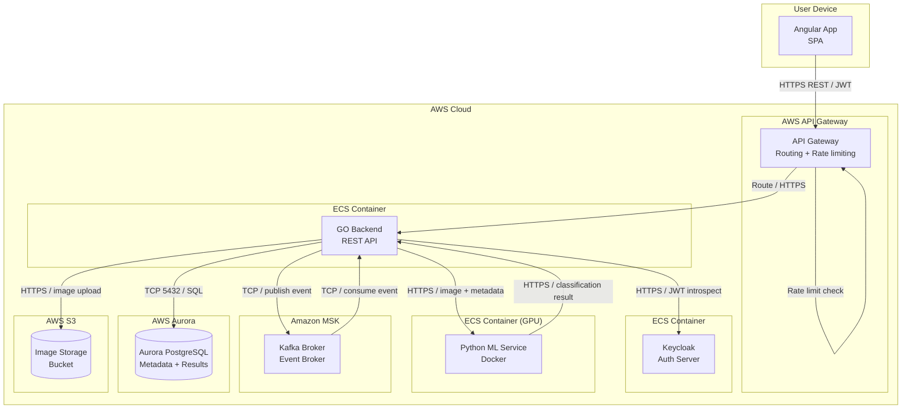

# Deployment / Physical view

Illustrates the physical organization of the aplication, its about "what code runs in what hardware"

> In this case, our entire system will be hosted on __AWS__ services

