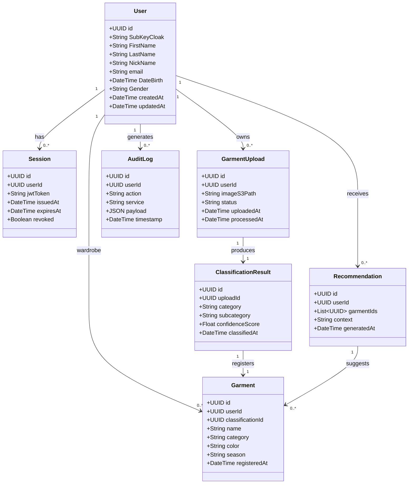
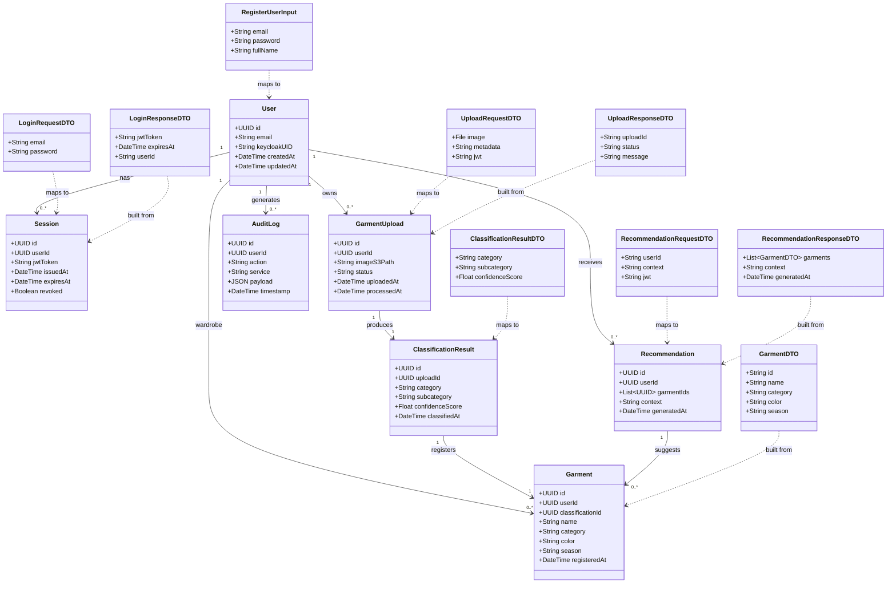

# Logical / Structural View

> **Nota:** These diagrams are for illustrative purposes only and are subject to change.

Concerns itself with the functionality that is provided by the system and how the code is designed to provide such functionality

> In this case, we only create domain models, since it is designed for object-oriented decomposition and our system is service-oriented / microservice-based

This object diagram is about the entities of domain. Esential entities for the data flow in this system. 

### 1. Domain model (pure 4+1)

---

This object diagram refers to the domain model (DTO mapping). It helps clarify what the client sends and what is stored, as well as identify the boundaries of transformation between layers.

### 2. Domain model + DTO mapping

