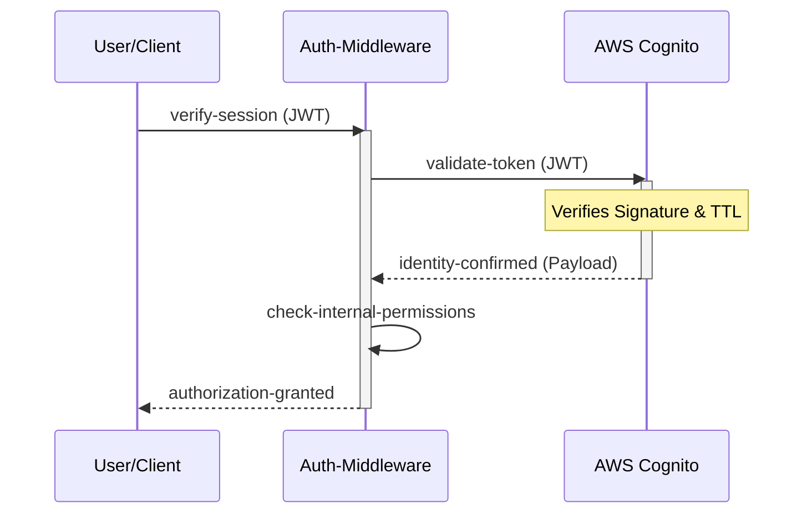

# Auth Module

```mermaid
sequenceDiagram
    participant U as User/Client
    participant A as Auth-Middleware
    participant AWS as AWS Cognito

    U->>A: verify-session (JWT)
    activate A
    A->>AWS: validate-token (JWT)
    activate AWS
    Note over AWS: Verifies Signature & TTL
    AWS-->>A: identity-confirmed (Payload)
    deactivate AWS
    A->>A: check-internal-permissions
    A-->>U: authorization-granted
    deactivate A
```