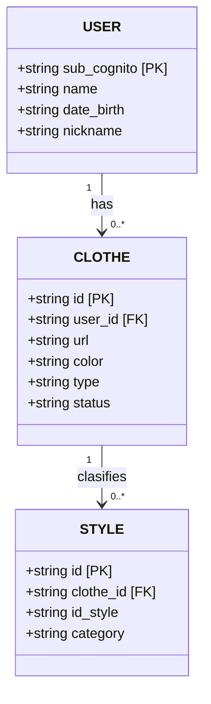

```mermaid
classDiagram
    direction TB
    
    class USER {
        +string sub_cognito [PK]
        +string name
        +string date_birth
        +string nickname
    }
    
    class CLOTHE {
        +string id [PK]
        +string user_id [FK]
        +string url
        +string color
        +string type
        +string status
    }
    
    class STYLE {
        +string id [PK]
        +string clothe_id [FK]
        +string id_style
        +string category
    }

    USER "1" --> "0..*" CLOTHE : has
    CLOTHE "1" --> "0..*" STYLE : clasifies
```