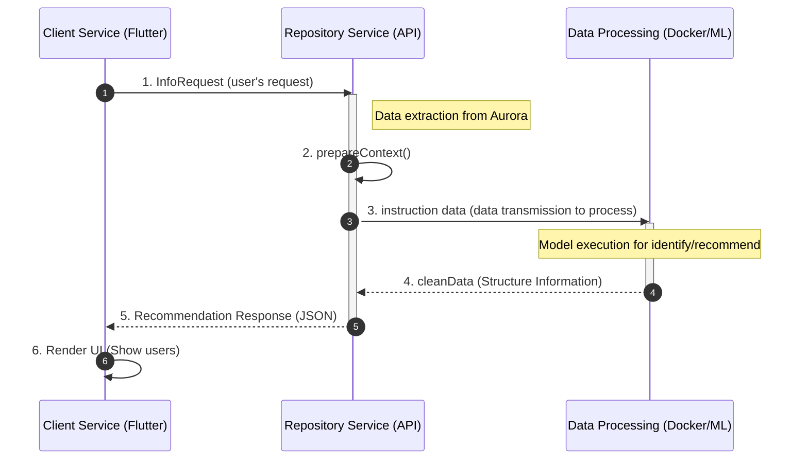

# Recomendation Module

```mermaid
sequenceDiagram
    autonumber
    participant C as Client Service (Flutter)
    participant R as Repository Service (API)
    participant DP as Data Processing (Docker/ML)

    C->>R: 1. InfoRequest (user's request)
    activate R
    Note right of R: Data extraction from Aurora
    R->>R: 2. prepareContext()
    R->>DP: 3. instruction data (data transmission to process)
    activate DP
    Note over DP: Model execution for identify/recommend
    DP-->>R: 4. cleanData (Structure Information)
    deactivate DP
    R-->>C: 5. Recommendation Response (JSON)
    deactivate R
    C->>C: 6. Render UI (Show users)
```