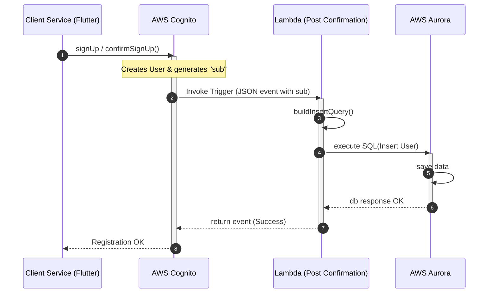

# Register Module

```mermaid
sequenceDiagram
    autonumber
    participant C as Client Service (Flutter)
    participant Cog as AWS Cognito
    participant L as Lambda (Post Confirmation)
    participant A as AWS Aurora

    C->>Cog: signUp / confirmSignUp()
    activate Cog
    Note over Cog: Creates User & generates "sub"
    
    Cog->>L: Invoke Trigger (JSON event with sub)
    activate L
    L->>L: buildInsertQuery()
    L->>A: execute SQL(Insert User)
    activate A
    A->>A: save data
    A-->>L: db response OK
    deactivate A
    
    L-->>Cog: return event (Success)
    deactivate L
    
    Cog-->>C: Registration OK
    deactivate Cog
```