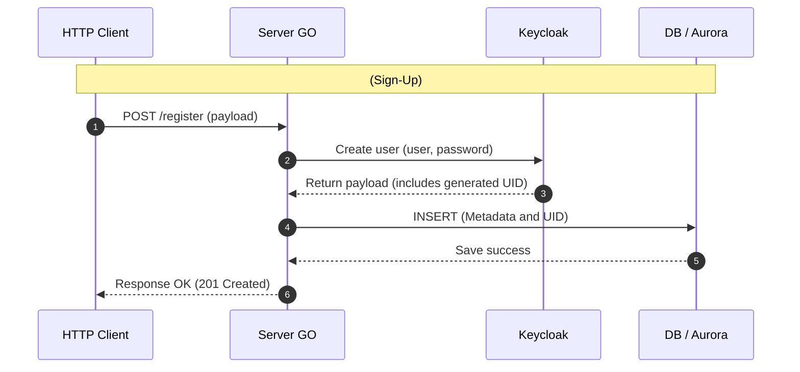

# Register Module

```mermaid
sequenceDiagram
    autonumber
    participant Client as HTTP Client
    participant Go as Server GO
    participant KC as Keycloak
    participant DB as DB / Aurora

    Note over Client, DB: (Sign-Up)
    
    Client->>Go: POST /register (payload)
    Go->>KC: Create user (user, password)
    KC-->>Go: Return payload (includes generated UID)
    Go->>DB: INSERT (Metadata and UID)
    DB-->>Go: Save success
    Go-->>Client: Response OK (201 Created)
```