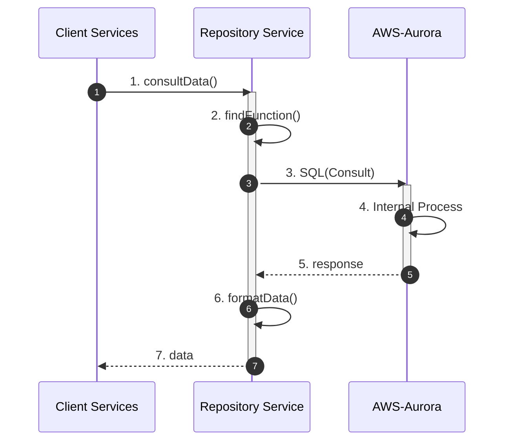

# Repository Module

```mermaid
sequenceDiagram
    autonumber
    participant C as Client Services
    participant R as Repository Service
    participant A as AWS-Aurora

    C->>R: 1. consultData()
    activate R
    R->>R: 2. findFunction()
    R->>A: 3. SQL(Consult)
    activate A
    A->>A: 4. Internal Process
    A-->>R: 5. response
    deactivate A
    R->>R: 6. formatData()
    R-->>C: 7. data
    deactivate R
```